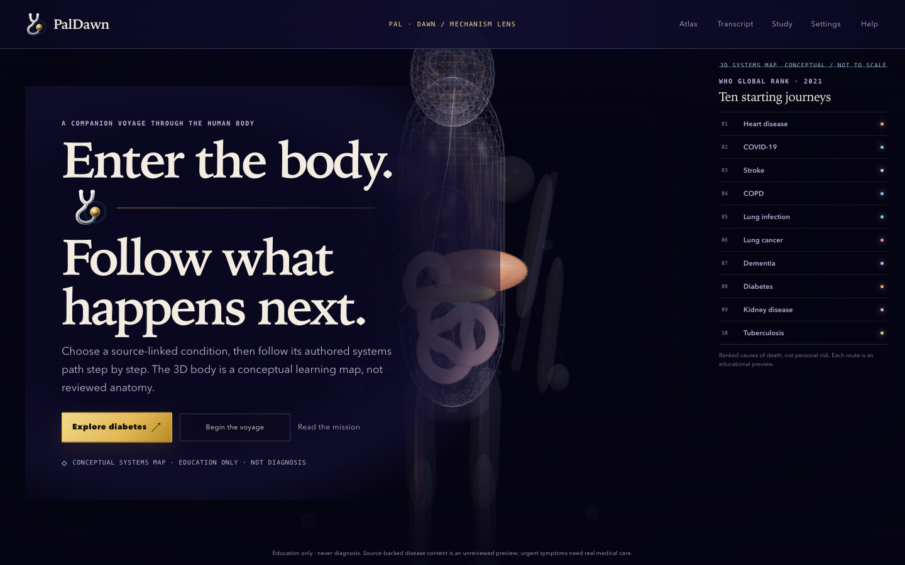

<p align="center">
  <a href="https://udhawan97.github.io/PalDawn/">
    
  </a>
</p>

<h1 align="center">PalDawn</h1>

<p align="center"><strong>Enter the body. Follow what happens next.</strong></p>

PalDawn is a source-linked 3D learning voyage for following cause and effect
through the body. The live app on `main` pairs ten WHO-ranked starting journeys
with a project-authored conceptual systems map, organ-level close focus, and
phase signals that make each authored mechanism step visible. A local Atlas
Wayfinder searches the existing conditions, phases, and structures, then opens
the exact preview route without sending or storing the query. A Research Lens
maps the bundled source records to the authored steps they support while
keeping index context and pending qualified review visibly separate. A new
Curriculum 50 planning catalog makes the intended breadth searchable across
twelve system families while only the ten existing previews can open; the
other forty remain visibly gated on sources and qualified review. Its
living-instrument design carries the animated PalDawn mark through the intro,
controls, scene materials, installed icon, and link preview without presenting
the procedural model as reviewed anatomy.

<p align="center">
  <a href="https://udhawan97.github.io/PalDawn/"><strong>Launch the web app</strong></a>
  · <a href="https://github.com/udhawan97/PalDawn/releases/tag/v0.3.0">Mechanism Lens release</a>
  · <a href="pipeline/provenance/README.md">Evidence gate</a>
</p>

<p align="center">
  <a href="https://github.com/udhawan97/PalDawn/actions/workflows/ci.yml"></a>
  <a href="LICENSE"></a>
  <a href="https://github.com/udhawan97/PalDawn/releases/tag/v0.3.0"></a>
</p>

> [!IMPORTANT]
> **The 3D body is a conceptual systems map, not reviewed anatomy.** Mechanism
> Lens adds high-detail procedural layers and source-linked educational
> synthesis, but neither has been reviewed by a
> named qualified clinician and cannot diagnose symptoms, calculate personal
> risk, or recommend treatment. No third-party anatomy asset or patient data is
> incorporated. If you think you may be having a medical emergency, contact
> your local emergency services immediately.

## Choose how to start

| Path | What you get | Requirement | Start |
|---|---|---|---|
| Web app | Current `main`, deployed as a static installable web app | JavaScript; WebGL2 for the 3D scene | [Open PalDawn](https://udhawan97.github.io/PalDawn/) |
| Text voyage | The same five authored stages without the 3D scene | JavaScript; choose **Use text voyage** in Settings or from the WebGL recovery screen | [Open PalDawn](https://udhawan97.github.io/PalDawn/) |
| Release snapshot | Immutable Mechanism Lens source at `v0.3.0` | Git or GitHub | [View v0.3.0](https://github.com/udhawan97/PalDawn/releases/tag/v0.3.0) |
| Local source | Current code, tests, and provenance checks | Node.js 22+; WebGL2 for 3D | [Run locally](#run-locally) |

There is no packaged desktop or mobile download. If your browser supports web
app installation, open **Settings → Installation help**; the browser remains
in charge of whether it offers **Install App** or **Add to Home Screen**.

The live website follows current `main`. The `v0.3.0` tag is the immutable
Mechanism Lens release snapshot. Systems Atlas remains available at `v0.2.0`,
and the original First Light systems release remains available at `v0.1.0`.

## What you can do today

- **Find an existing route.** Search the Atlas for a condition, mechanism
  phase, or highlighted structure, then arrive at the matching preview step and
  close-focus target. Search stays local and only indexes bundled content.
- **Trace the authored evidence map.** Open Research Lens to distinguish index
  context from step-linked WHO and NIH/NIDDK records, then return directly to a
  covered mechanism phase. The map describes linkage, not evidentiary strength.
- **Explore ten disease pathways.** Start from the WHO 2021 top ten global
  causes of death and follow a compact, source-linked mechanism through the
  body. The ranking describes global mortality, not personal risk.
- **Inspect the 50-condition plan.** Search or filter the wider global-burden
  curriculum by system. It is a coverage plan rather than a universal rank;
  forty entries are deliberately non-explorable until their source, asset, and
  qualified-review gates pass.
- **See each phase change.** Follow a data-driven signal route across only the
  structures named by the current step, then select a highlighted structure to
  enter close focus with layered geometry and a visible phase lens.
- **Follow diabetes in depth.** Move through digestion, glucose absorption,
  insulin release, cellular response, type 1/type 2/gestational divergence,
  hyperglycaemia, kidney response, ketones, and long-term vessel, eye, kidney,
  and nerve effects.
- **Inspect a 3D systems map.** Highlight or separate the brain, eyes, lungs,
  heart, vessels, liver, pancreas, digestive tract, kidneys, bladder, nerves,
  muscles, adipose tissue, immune system, and skeleton. Every form is
  project-authored procedural geometry and deliberately not to scale.
- **Choose reading depth.** Switch each disease step between Plain English and
  Clinical terms, then open its direct WHO or NIH/NIDDK evidence links.
- **Follow one coherent route.** Move through Approach → Surface trace → Portal
  → Flow corridor → Arrival using play, scrub, stage, or keyboard controls.
- **Change the explanation, not the scene.** Switch between Guide and
  Engineering narration, search the complete transcript, or compare both
  tracks side by side.
- **Make the voyage yours—locally.** Resume, save stages, write bounded private
  notes, mark personal checkpoints, and export study Markdown or a validated
  local backup. PalDawn warns against entering patient or personal health data.
- **Choose a calmer route.** Use reduced motion, a stage-by-stage text voyage,
  caption sizing, high contrast, a comfort vignette, and keyboard navigation.
- **Inspect the boundary.** On-device diagnostics, quality controls, evidence
  records, and fail-closed adoption checks stay visible rather than becoming
  invisible implementation detail.



*Current `main` introduction after the animated-logo redesign. The body remains
deliberately project-authored, conceptual, and visibly synthetic; it is not an
anatomical reconstruction.*

## How the voyage works

1. **Approach** — establish the synthetic route and its limits.
2. **Surface trace** — follow one normalized path shared by the scene systems.
3. **Portal** — cross a bounded transition with a non-transparent fallback.
4. **Flow corridor** — observe route-driven analytic markers without treating
   them as blood flow or anatomy.
5. **Arrival** — review the route, transcript, saved stages, and private study
   material on your device.

## Trust boundary

| Area | Current behavior |
|---|---|
| Data | No account or backend. Resume state, preferences, bookmarks, private notes, and checkpoints stay in browser storage until you export or reset them. Atlas search queries are transient and are neither stored nor sent. |
| Network | The deployed app loads static same-origin files. It has no analytics SDK or outbound telemetry path; the offline shell caches only PalDawn-owned assets. |
| AI | No runtime AI provider, model call, or API key is used. SPD is authored interface guidance, not a diagnostic agent. |
| Medical content | Mechanism Lens contains source-linked, unreviewed educational synthesis and project-authored illustrative geometry. Both are visibly bounded and never presented as diagnosis, treatment selection, reviewed anatomy, or professional clinical training. |
| Provenance | Candidate assets and content fail closed until license, lineage, source, and—where medical—named qualified-human review requirements pass. |
| Updates | Modern clients offer **Update and reload open tabs** and activate only after every open PalDawn tab verifies its local work is saved; a failed save pauses the update without reloading. An older client’s legacy **Update now** request is intentionally vetoed because it cannot verify memory-only work: keep that tab open to copy or save its work, then close and reopen PalDawn before retrying. The browser may also activate a waiting build after all PalDawn tabs close. |

The audited Z-Anatomy heart and coronary candidates remain
planned/pending/blocked with null adoption output. See the
[asset audit](docs/research/paldawn-heart-coronary-asset-audit.md),
[project plan](docs/PLAN.md), [NOTICE](NOTICE.md), and [credits](CREDITS.md).

## Run locally

```bash
git clone https://github.com/udhawan97/PalDawn.git
cd PalDawn/app
npm ci
npm test
npm run dev
```

Open the URL printed by Vite. `npm test` type-checks, builds, validates the
five-stage journey and synthetic-only boundary, checks the offline/local-data
and Atlas-wayfinding contracts, and enforces the 500 KB gzip JavaScript budget.
The same gate also validates the local Research Lens source-to-step map.

Run the independent provenance gate from the repository root:

```bash
node pipeline/provenance/run-checks.mjs
```

For a project-site production build, use the same base path as GitHub Pages:

```bash
cd app
VITE_BASE_PATH=/PalDawn/ npm test
```

<details>
<summary><strong>Repository map</strong></summary>

| Path | Purpose |
|---|---|
| `app/` | Vite, React, TypeScript, Three.js, React Three Fiber, PWA shell, and browser tests |
| `app/src/data/p0-journey.json` | Bounded five-stage journey data |
| `app/src/data/diseases.ts` | Ten sourced disease definitions and body-system steps |
| `app/src/data/diseaseCatalog.ts` | Fifty-condition curriculum registry with explorable/planned gates |
| `app/src/data/atlasSearch.ts` | Bounded local index over existing Atlas routes and structures |
| `app/src/data/atlasEvidence.ts` | Fail-closed source-to-step coverage map for the Research Lens |
| `app/src/scene/HumanSystemsScene.tsx` | Project-authored layered body map, phase signals, and organ close-focus camera |
| `app/src/scene/SceneCanvas.tsx` | Lazy-loaded WebGL scene boundary kept available through the offline asset manifest |
| `docs/BRAND-SYSTEM.md` | Living mark, palette, typography, motion, generated assets, and authority boundary |
| `docs/MECHANISM-LENS.md` | v0.3 visual contract, interaction model, and safety boundary |
| `docs/ATLAS-WAYFINDING.md` | P2 route-search behavior, privacy boundary, and verification contract |
| `docs/ATLAS-RESEARCH-LENS.md` | Evidence-navigation behavior, review boundary, and verification contract |
| `docs/CURRICULUM-50.md` | Global-burden curriculum method, multiscale engine plan, and content gates |
| `docs/VISION.md` | Mission, body/disease/drug simulation north star, quality bar, and current limits |
| `docs/FOUNDATION-PLUS-4.md` | Disease explorer guide, sources, controls, and boundaries |
| `pipeline/provenance/` | Schema, validator, fixtures, and adoption records |
| `docs/PLAN.md` | Product architecture, medical gates, and roadmap |
| `docs/research/` | Primary-source reconnaissance and asset-audit dossiers |
| `.github/workflows/` | CI and GitHub Pages publication |

</details>

## Contribute

Start with [CONTRIBUTING.md](CONTRIBUTING.md). Code changes must pass the app
and provenance checks. Art, model, and medical-content proposals must preserve
the repository’s license zones and evidence-before-adoption rule.

Code is MIT licensed. Future PalDawn-authored educational content and compatible
derived asset packs are intended for CC BY-SA 4.0; each adopted upstream keeps
its own exact license and lineage.

PalDawn was formerly named Antaryaan. Historical research prompts retain their
original wording where changing it would damage the audit trail.
