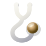
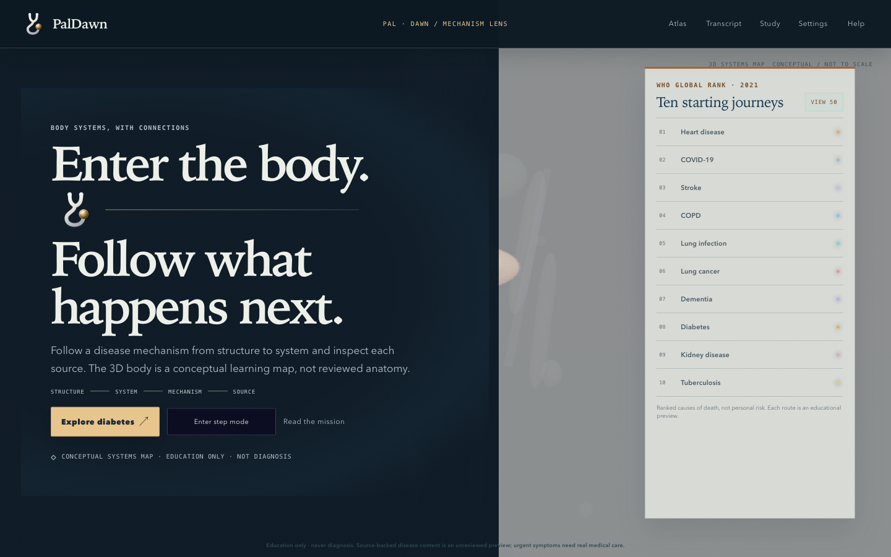
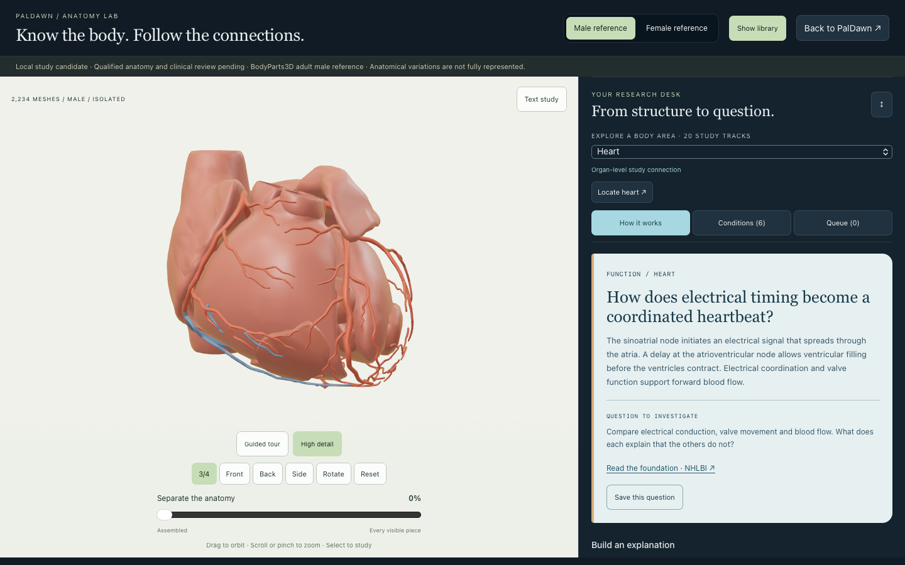

<p align="center">
  <a href="https://udhawan97.github.io/PalDawn/">
    
  </a>
</p>

<h1 align="center">PalDawn</h1>
<p align="center"><strong>Know the body. Follow the connections.</strong></p>

PalDawn brings structure and mechanism into one visual study companion. Follow a
disease pathway through the public conceptual systems map, or prepare the local
Anatomy Lab to examine credited male and female reference assemblies and turn a
body part into a source-linked research question. It is for curious learners,
including medical students exploring further reading. Its educational content
is **unreviewed**; it is not a clinical training curriculum, diagnostic tool, or
treatment guide.

<p align="center">
  <a href="https://udhawan97.github.io/PalDawn/"><strong>Open the web app ↗</strong></a>
  · <a href="docs/GETTING-STARTED.md">Getting started</a>
  · <a href="https://github.com/udhawan97/PalDawn/releases/tag/v0.4.0">v0.4.0 source release</a>
</p>

<p align="center">
  <a href="https://github.com/udhawan97/PalDawn/actions/workflows/ci.yml"></a>
  <a href="LICENSE"></a>
</p>

## Two ways into the body

| Start here | What you can explore | What you need |
|---|---|---|
| [Web app](https://udhawan97.github.io/PalDawn/) | Ten disease previews, source navigation, a conceptual body map, and a private learner workspace | JavaScript; WebGL2 for 3D. A text voyage is available. |
| [Anatomy Lab — local preview](docs/ANATOMY-LAB.md) | Male/female reference meshes, 20 body-area research tracks, 113 condition-reading topics, and a session reading plan | Node.js 22+, Git, curl, and separately prepared reference packs. Qualified anatomy/clinical review is pending. |
| [v0.4.0 source](https://github.com/udhawan97/PalDawn/releases/tag/v0.4.0) | The immutable Study and Reliability snapshot | Source archives, not a native installer. New research-desk work is on `main`, after this tag. |

Both paths share PalDawn's source-first study language, but they do not share a
distribution boundary. The public app is deployed from `main` through GitHub
Pages. **Anatomy Lab is excluded from that build.** A merge does not publish the reference anatomy.
No desktop or mobile installer is provided; supported browsers may offer web-app
installation. See [installation, updates, and help](docs/GETTING-STARTED.md).

## Follow a mechanism from system to source

Start with **Explore diabetes**, choose an explanation depth, and move through
its authored steps. Select a highlighted structure for a closer view. Open
**Research Lens** to see which bundled source records link to the current step.

- **Find a route:** Atlas Wayfinder searches existing conditions, phases, and
  structures and opens the matching preview.
- **Read at your depth:** Plain English and Clinical terms offer two explanations
  of the same disease step.
- **Keep your place:** First Light supports saved stages, private notes,
  checkpoints, transcript comparison, and study/backup exports.
- **Set the pace:** choose reduced motion, text voyage, caption sizing, high
  contrast, and keyboard navigation.



*Public-build introduction captured from current source. The procedural body is
illustrative, not to scale, and not reviewed anatomy. The ten previews are
unreviewed educational synthesis. Curriculum 50 is a plan: forty entries remain
gated, not forty additional lessons.*

## Anatomy Lab: turn a body part into a research question

**Local candidate · not in the public web app.** Start with a structure or choose
any reading area independently. The research desk connects short function
introductions, condition topics, inquiry prompts, and authoritative source links.

1. **Explore the reference.** Search a structure, isolate it, switch layers, or
   use a visual cutaway. Male and female assemblies have different coverage.
2. **Ask how it works.** Choose from 20 body-area tracks—from heart and lungs to
   nerves, eyes, immunity, hormones, and reproductive anatomy.
3. **Broaden the reading.** Search 113 distinct condition topics, open MedlinePlus
   sources, and follow PubMed searches into the literature.
4. **Make your own plan.** Save questions or conditions, choose compact cards or
   a wider research layout, then export your selected reading as Markdown.



*An actual local study view. The 113 topics are reading links, not newly authored
lessons or disease animations. PubMed links are searches, not appraised papers.
The reading queue survives navigation between references but resets on reload;
export it before closing.*

The male reference contains 2,234 meshes; the female assembly contains 888,
with **partial skeleton and muscle coverage**. They are not a matched pair and
do not cover every body part, variation, or ailment. A related reading suggestion
does not establish disease in the selected mesh. Source attribution remains
visible in the viewer and [candidate guide](docs/ANATOMY-LAB.md).

[Run Anatomy Lab →](docs/ANATOMY-LAB.md) ·
[Research-desk details →](docs/ANATOMY-RESEARCH-DESK.md)

## Your work and your sources

| Area | What to expect |
|---|---|
| Local work | No account or backend. Public-app preferences and learner work use browser storage. Anatomy study lists and reading queues use session memory only. Do not enter patient or personal health data. |
| Network | Static app files load from the site. Opening an evidence or PubMed link contacts that external site. Anatomy preparation downloads public source packs and directories. No analytics SDK or runtime AI provider is used. |
| Evidence | Citations help you inspect the source; they do not certify the synthesis. Named qualified-human review remains pending. |
| Updates and backups | Export important work. Public-app updates check that open tabs can save before reloading. See the [update and recovery guide](docs/GETTING-STARTED.md#updates-and-local-work). |
| Scope | Education only. No diagnosis, personal-risk calculation, treatment selection, validated physiology, or patient-specific simulation. |

## Run locally

Install Node.js 22+ and Git, then:

```bash
git clone https://github.com/udhawan97/PalDawn.git
cd PalDawn/app
npm ci
npm test
npm run dev
```

Open the URL printed by Vite. This starts the normal public app; follow the
[separate preparation steps](docs/ANATOMY-LAB.md#run-the-complete-candidate) for
Anatomy Lab. For the GitHub Pages base path, run
`VITE_BASE_PATH=/PalDawn/ npm test` from `app/`.

From the repository root, verify source/asset adoption boundaries:

```bash
node pipeline/provenance/run-checks.mjs
```

[App commands and architecture](app/README.md) ·
[Troubleshooting](docs/GETTING-STARTED.md#troubleshooting) ·
[Changelog](CHANGELOG.md)

## Contribute and explore the plan

Read [CONTRIBUTING.md](CONTRIBUTING.md) and the
[evidence gate](pipeline/provenance/README.md) before proposing content or assets.
Code checks and browser acceptance do not replace qualified medical review.

- [Vision and limits](docs/VISION.md) · [Project plan](docs/PLAN.md)
- [Curriculum 50](docs/CURRICULUM-50.md) · [Evidence navigation](docs/ATLAS-RESEARCH-LENS.md)
- [Brand and editable assets](docs/BRAND-SYSTEM.md)
- [Heart graphics workbench](docs/HEART-GRAPHICS-WORKBENCH.md) ·
  [Synthetic flow study](docs/VESSEL-FLOW-WORKBENCH.md)—separate unreviewed studies,
  excluded from the public build.

Code is [MIT licensed](LICENSE). Upstream anatomy retains its own license and
lineage; see [credits](CREDITS.md) and [NOTICE](NOTICE.md). Future authored content
and compatible derived packs are intended for CC BY-SA 4.0, subject to adoption
review. PalDawn was formerly named Antaryaan; historical research keeps that name
where it preserves the audit trail.
