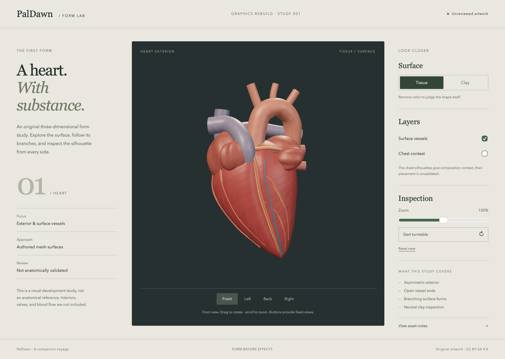

# Heart graphics workbench — first implementation

2026-09-07. This is a local graphics-development milestone of the
[graphics rebuild](GRAPHICS-REBUILD.md), not a new anatomical release.

## Delivered

An original heart exterior study replaces the sphere approach in a separate
workbench. It has an asymmetric lofted ventricular surface, folded upper
forms, hollow major-vessel forms, and branching surface vessels evaluated
against the same underlying surface coordinates. Optional neutral chest
silhouettes give composition context.

The viewer provides tissue and clay modes; front, left, back, and right
views; mouse/touch orbit; bounded zoom; an optional turntable; and reset.
The actual canvas occupies its own layout column. Camera fitting uses
visible mesh bounds and canvas aspect instead of estimating sidebar offsets.
Reduced motion disables turntable motion and retains fixed views. Static
inspection uses demand rendering. Hidden pages pause automatic rotation.

Editable profiles and branch paths generate a reproducible GLB. The manifest
records digests and actual geometry counts. Loading verifies the GLB digest,
fails visibly on unavailable/corrupt assets, and offers retry. The workbench
does not register the application's service worker or read study storage.

## Coverage ledger

These are art-development coverage assessments, not anatomy approvals.

| Requested detail | This milestone | Outstanding |
|---|---|---|
| Recognizable exterior silhouette | Original asymmetric surface with tapered lower form and separated upper contours. | Qualified anatomy review, more faithful landmark definition. |
| Surface texture and tissue appearance | Opaque vertex-colored surfaces, subtle geometric variation, stock physical materials. | Authored UV maps, fine tissue textures, measured material refinement. |
| Major connections | Open-ended vessel forms with visible wall thickness. | Validated identity, dimensions, branching, attachment and chamber connections. |
| Surface arteries and veins | Distinct surface-following paths and surrounding fat-colored forms. | Validated coronary topology and fine branch coverage. |
| Body/chest context | Neutral original paired silhouettes, optional and separately framed. | Complete chest, ribs, skin, true lung detail, anatomical placement and containment review. |
| Heart interior and valves | Absent. | Dedicated chamber/valve assets and cutaway geometry. |
| Blood cells and flow | Absent. | R3's cell mesh, lumen, wall containment and flow architecture. |
| Contraction and cinematic journey | Static inspection plus an optional turntable. | R4's seekable timeline and authored deformation/shot program. |
| Clinical/anatomy review | Pending; no reviewer has signed off. | Named qualified reviewer and scoped evidence before promotion. |

R1 now has original editable artwork, an explicit source decision, and a
coverage ledger. R2 has a working isolated static viewer. **Neither milestone
has passed its full anatomical acceptance gate.** The public app's existing
procedural scene remains in place until a replacement is eligible.

## Source decision and refreshed evidence

The implementation uses original artwork rather than an imported candidate
mesh. Its source and artifact lineage are in
[the content pack](../content/graphics/heart-study/README.md).

The [official BodyParts3D archive license page](https://dbarchive.biosciencedbc.jp/en/bodyparts3d/lic.html),
checked 2026-09-07, identifies CC BY 4.0 and displays an update date of
2025-02-27. This differs from the older CC BY-SA 2.1 Japan evidence retained
in the repository's pinned-source audit. The
[current archive download page](https://dbarchive.biosciencedbc.jp/en/bodyparts3d/download.html)
lists version 4.0 mesh archives with 99% polygon reduction. Those are future
audit candidates, not incorporated geometry. Do not retroactively relabel
the repository's old snapshots or infer new object-level approval.

The previously audited Z-Anatomy records remain planned/pending/blocked.
No third-party meshes, texture imagery, patient data, or new dependency was
adopted by this workbench. No clinical claims, FMA mappings, TA2 mappings,
anatomical correctness, or flow validity are certified here.

## Run and validate

From `app/`:

```sh
npm run graphics:generate
npm test
npm run graphics:build
npm run graphics:test
npm run graphics:dev
```

`npm test` includes deterministic mesh reproduction, manifest freshness,
finite vertex data/index/normal checks, outward tube-normal checks, 40 camera
framing cases, and public-build exclusion. The dedicated browser suite covers
view/material/layer controls, turntable/reset, portrait/landscape layouts,
reduced motion and keyboard operation, asset failures/retry, and corrupt-byte
rejection in Chromium and WebKit. Its captures are written to ignored
`output/playwright/heart-study/`.

Native Safari is also inspected separately. Browser screenshots and UI tests
do not establish medical accuracy or meet the project's performance proof
protocol. Physical-mobile performance and the complete cinematic journey
remain unverified.

## Next step

Review the clay turntables against qualified anatomical references and record
specific geometry corrections. Complete the missing heart/chest geometry and
review ownership before adopting the asset into the public app. The accepted
rebuild plan's blood-flow and cinematic milestones follow that work.

## Verification recorded for this implementation

- `npm test`: passed, including the public app's existing contracts and the
  new deterministic mesh / camera / build-exclusion checks.
- `npm run graphics:build`: passed. The workbench JavaScript is approximately
  316.5 KB gzip; its separate mesh is 5,688,164 bytes. These are build sizes,
  not load-time or frame-rate measurements.
- `npm run graphics:test`: 14/14 passed in Chromium and WebKit. Includes actual
  turntable motion, stable paused pixels, and WebGL context-loss retry.
- Provenance checks: passed with existing candidate blocks retained. Dependency
  license inventory: 95 packages, zero denied; the two existing MPL review
  entries remain. No dependency was added.
- Native Safari: inspected tissue and clay, side/front views, chest context,
  turntable pause, reset, and coverage notes on the local workbench.

The retained images below come from Playwright WebKit at a 1440 × 1000 CSS
viewport, DPR 2. They are visual evidence of this unreviewed artwork, not native
Safari screenshots or medical validation.



[Left clay view](../content/graphics/heart-study/previews/left-clay.png) ·
[Back clay view](../content/graphics/heart-study/previews/back-clay.png)
